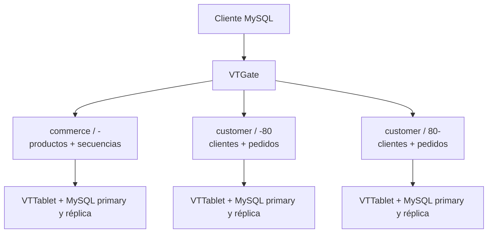

# Vitess: escalar MySQL horizontalmente · edición 2026

Laboratorio y artículo en español, actualización del [artículo de 2022](https://www.linkedin.com/pulse/vitess-o-como-escalar-con-mysql-de-manera-horizontal-abadia-lopez/) de Cristo Fernando Abadia Lopez.

**[Leer el artículo actualizado](docs/articulo.md)** · **[Texto breve para LinkedIn](docs/post-linkedin.md)** · **[Fuentes y versiones](docs/fuentes.md)**

Vitess **24.0.3**, Operator **2.17.1**, Kubernetes **1.35.0**. Versiones consultadas el **17 de septiembre de 2026**, fijadas en `versions.json`. Kubernetes 1.35.0 es la base reproducible elegida para este laboratorio, no una afirmación sobre el último parche ni una recomendación para producción.

El ejercicio carga 20 clientes y 40 pedidos, mueve ambas tablas a un keyspace separado y distribuye sus filas en dos shards. Conserva productos y secuencias en un keyspace sin fragmentar.



## Requisitos

- Linux **amd64**, o un equipo x86 con Docker y Minikube. Las tres imágenes fijadas de Vitess/Operator publican `linux/amd64`; no se promete ejecución nativa en Apple Silicon/ARM. Desde un Mac ARM, ejecuta este repositorio dentro de una VM o máquina Linux amd64.
- Docker Engine arrancado, Minikube, `kubectl`, Python **3.10+**, Git.
- Al menos 4 CPU, **11 GB de RAM disponibles para Minikube** y unos 50 GB libres. Durante el resharding conviven los shards de origen y destino.
- Acceso a los registros de contenedores. Un único nodo Minikube, con su StorageClass predeterminada: el backup local `hostPath` procede del ejemplo oficial y no sirve para un clúster multinodo.

No necesitas instalar `vtctldclient` ni el cliente MySQL en el host: `lab.py` los ejecuta dentro del pod `vtctld`, con la imagen de la misma versión.

## 1. Crear y cargar datos

```bash
git clone https://github.com/pvtoCalvo/vitess-mysql-sharding-lab.git
cd vitess-mysql-sharding-lab
python3 lab.py up
python3 lab.py init
python3 lab.py status
```

Todos los comandos Kubernetes usan explícitamente el contexto **`vitess-lab`**. `up` crea ese perfil Minikube, instala el operador en `default` y el clúster en el namespace `vitess-lab`. Usa un perfil nuevo y dedicado a este ejercicio. `init` carga el seed una sola vez; no debe repetirse después de mover tablas.

## 2. Mover tablas entre keyspaces

```bash
python3 lab.py move-prepare
python3 lab.py move-create
python3 lab.py move-check
python3 lab.py move-switch
python3 lab.py verify
```

`move-switch` vuelve a ejecutar un VDiff nuevo y valida su UUID, workflow, keyspace, estado, filas y diferencias; después cambia las lecturas de `replica` y las escrituras de `primary`, con `dry-run` previo a cada cambio. El ejemplo no despliega tablets `rdonly`.

Durante la ventana de evaluación puedes regresar al origen:

```bash
python3 lab.py move-reverse
# Si quieres continuar el ejercicio después de revertir:
python3 lab.py move-switch
```

Cuando hayas validado el destino, cierra el workflow. **Este paso elimina las tablas de origen y termina la posibilidad de reversión mediante ese workflow**:

```bash
python3 lab.py move-complete --confirm-complete
```

## 3. Sustituir AUTO_INCREMENT y fragmentar

Detén cualquier escritor adicional mientras ejecutas `reshard-prepare`: esta transición de esquema didáctica no automatiza una migración online de AUTO_INCREMENT. Calcula cada secuencia por encima del `MAX(id)` existente y conserva el mayor `next_id` al reintentarlo.

```bash
python3 lab.py reshard-prepare
python3 lab.py reshard-create
python3 lab.py reshard-check
python3 lab.py reshard-switch
python3 lab.py verify
python3 lab.py distribution
python3 lab.py sequence-check
```

`distribution` consulta explícitamente `customer:-80` y `customer:80-`, comprueba que ambos contienen filas del seed y que las sumas son 20 clientes y 40 pedidos. No exige una distribución exactamente 50/50. `sequence-check` inserta un cliente y un pedido sin proporcionar sus IDs y conserva esas dos filas de prueba.

Para volver al shard original antes de cerrar el workflow:

```bash
python3 lab.py reshard-reverse
# Regresar al destino antes de completar:
python3 lab.py reshard-switch
```

Finalizar, únicamente después de evaluar el nuevo destino:

```bash
python3 lab.py reshard-complete --confirm-complete
```

El comando completa VReplication y aplica `k8s/04-final.yaml`, que retira el shard antiguo del estado deseado del operador. No apliques ese YAML antes del cambio de tráfico y la finalización del workflow.

## Inspección y acceso

```bash
python3 lab.py vt GetKeyspaces
python3 lab.py vt GetTablets
python3 lab.py vt Reshard --target-keyspace customer --workflow customer2shards status
python3 lab.py forward
```

`forward` permanece en primer plano; Ctrl-C termina únicamente los procesos de port-forward que ha creado. VTAdmin: <http://127.0.0.1:14000>. MySQL: `127.0.0.1:15306`, usuario `user`, contraseña vacía, solo para este laboratorio. También puedes consultar sin port-forward:

```bash
printf 'SELECT * FROM customer WHERE customer_id = 7;\n' | python3 lab.py sql customer
```

Los comandos manuales equivalentes de Vitess se pueden ejecutar con `python3 lab.py vt ...`; el wrapper aporta el servidor y el contenedor adecuados. Tras completar un workflow sus comandos de estado/VDiff dejan de estar disponibles.

## Validación

```bash
python3 -m venv .venv
. .venv/bin/activate
python -m pip install -r requirements-dev.txt
python checks.py
python -m unittest -v
```

Se verifican los cuatro estados contra el CRD incluido, el namespace vigilado por el operador, las imágenes, el checksum, las secuencias y el orden del cambio de tráfico. Los tests rechazan VDiff incompletos, vacíos, de otro workflow o con diferencias; comprueban que un fallo de lecturas impide cambiar escrituras.

**Estado de entrega:** estas validaciones estáticas y unitarias se ejecutaron correctamente. El recorrido completo en Kubernetes no se ejecutó en el equipo de preparación (Mac ARM, motor Docker apagado). El workflow de CI verifica configuración y lógica; no constituye una prueba de integración del clúster. No se publican benchmarks ni garantías de ausencia de interrupciones.

## Diagnóstico

- `exec format error`: revisa la arquitectura; estas imágenes están publicadas para amd64.
- `Pending`: consulta `kubectl --context vitess-lab -n vitess-lab describe pod NOMBRE` y comprueba RAM/PVC/StorageClass.
- Sin primary: revisa `python3 lab.py status` y los logs de los pods `vtorc` y `vtbackup`; no fuerces una promoción a ciegas.
- `VDiff` pendiente o con diferencias: inspecciona el workflow con `show` y `status`; no continúes con `switchtraffic`.
- Puerto ocupado: cierra el port-forward anterior con Ctrl-C. No mates procesos `kubectl` ajenos al laboratorio.
- Si falla un paso, inspecciona el estado y continúa desde el comando correspondiente; no vuelvas a aplicar un manifiesto de una fase anterior sobre un clúster ya migrado.

## Limpieza

```bash
python3 lab.py down --confirm-destroy
```

Elimina el perfil Minikube `vitess-lab` completo, incluidos sus datos. No lo ejecutes sobre un perfil que contenga otros trabajos.

## Alcance

Configuración didáctica: una cell, dos tablets por shard, `durabilityPolicy: none`, servicios internos, VTAdmin de solo lectura y port-forward ligado a loopback. Los usuarios y permisos MySQL del ejemplo son deliberadamente amplios y carecen de contraseñas de producción. Antes de desplegar un servicio real, diseña autenticación, TLS, aislamiento de red, durabilidad, almacenamiento compartido/remoto de backups, restauración, observabilidad y alta disponibilidad entre dominios de fallo.

Licencia Apache-2.0. Consulta [NOTICE](NOTICE) para la procedencia de los manifiestos.
